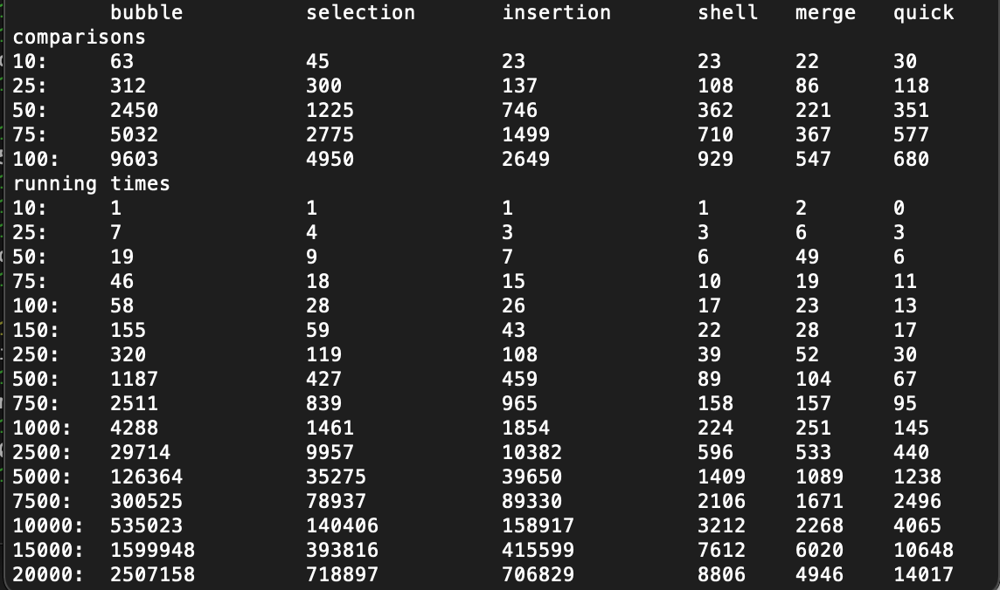

# c-sorts
I analysized the efficiency of different sort algorithms written in C. First, I wrote the most common sorting algorithms in C. Then, I wrote a program to calculate the run time of the various sorts for different array sizes. After, I analyzed the data using Python to create graphs and draw conclusions about data efficiency.

# Output
The code print the number of comparisons and the running times for the different sorting algorithms based on the number of elements in the array. Run times are printed in microseconds.




# Usage
The sorting algorithms are found in `sorts.c`. Run `experiments.c` to view the efficiency of different sorting algorithms. Run times are given in microseconds. `csci245-project1.ipynb` contains the data analytics based on the experimental efficiency data and predicted run times in terms of big O.

To run `experiments.c`, include an output .csv file to print the experimental data.
```
make experiments
./experiments experimentdata.csv
```
